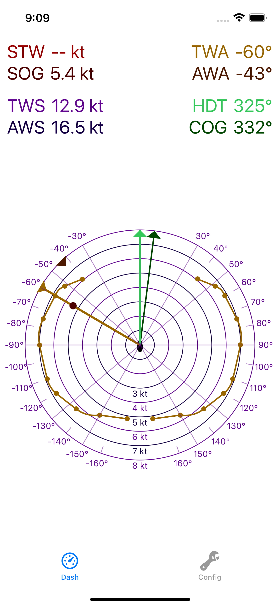

# Polar VDR - iOS

Visualize your sailing performance. Connect Polar VDR connects to you onboard instruments capable of streaming NMEA0183 data over
TCP. Polar VDR can read the following NMEA0183 sentences:
- VHW - Water speed and heading
- VTG - Track made good and ground speed
- HDT - Heading true 
- HDG - Heading magnetic
- MWV - Wind speed and angle
- RMC - Recommended minimum navigation information

Sailing polar profiles built into app:
- Tartan 37
- J/35
- (More / customizable profiles TBD)

## Screenshots

| Dash 1                           |              Dash 1              |              Config              |
|----------------------------------|:--------------------------------:|:--------------------------------:|
|  |  |  |

## Dash 

STW = Speed Through Water
SOG = Speed Over Ground

TWS = True Wind Speed
AWS = Apparent Wind Speed

TWA = True Wind Angle
AWA = Apparent Wind Angle

HDG = Heading Magnetic
HDT = Heading True
COG = Course over ground

## Features

| Feature                     |    Status     |
|-----------------------------|:-------------:|
| Dash - ground & water speed |    ☑️ Done    |
| Dash - wind speeds          |    ☑️ Done    |
| Dash - wind angles          |    ☑️ Done    |
| Dash - course and heading   |    ☑️ Done    |
| Dash - Adaptive Polar       |    ☑️ Done    |
| Dash - polar efficiency     | ❌️ Incomplete |
| Nmea over TCP               |    ☑️ Done    |
| Voyage record               | ❌️ Incomplete |
| Voyage list                 | ❌️ Incomplete |
| Voyage map                  | ❌️ Incomplete |
| Voyage playback             | ❌️ Incomplete |
